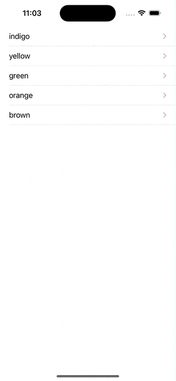

# Learning-UI

# I. LazyGrid

## 1.1 LazyvGrid

```swift
private var gridItems = [GridItem(.flexible()), GridItem(.flexible()), GridItem(.flexible())]

var body: some View {
    // 1
    ScrollView {
        // 2
        LazyVGrid(columns: gridItems, spacing: 20) {
            // 3
            ForEach(icons, id: \.self) {
                // 4
                Image(systemName: $0)
                    .font(.system(size: 30))
                    .frame(width: 50, height: 50)
                    .background(Color.red)
                    .cornerRadius(10)
            }
        }
    }
}
```

Output:


- Ta cần nhúng `Grid` trong `ScrollView`.` bản thân Grid không tự scroll, để có thể cuộn Grid chúng ta cần để nó trong ScrollView`.

### 1.1.1 Layout Grid

Như đã nói bên trên, `layout` của Grid được xác định bằng mảng gridItems. Bên trên chúng ta tạo gridItems gồm 3 phần tử, nên Grid hiển thị ra 3 cột.

- `VD1`: Giờ ta muốn 1 hàng gồm 3 items, mỗi item cách nhau 20, width self-sizing theo màn hình:


```swift
    var body: some View {
        // 1
        ScrollView {
            // 2
            LazyVGrid(columns: gridItems, spacing: 110) {
                // 3
                ForEach(icons, id: \.self) {
                    // 4
                    Image(systemName: $0)
                        .font(.system(size: 30))
//                        .frame(width: 50, height: 50)
                        .frame(minWidth: 0, maxWidth: .infinity)
                        .frame(height: 50)
                        .background(Color.red)
                        .cornerRadius(10)
                }
                
            }
            .padding(.leading, 15)
            .padding(.trailing, 15)
            .padding(.top, 10)
            .border(.blue, width: 5)
        }
        .border(.yellow, width: 5)
        
        Spacer()
    }
```

Output:


- Ở đây ta thấy spacing của `LazyVGrid` là 110, nghĩa là spacing giữa các hàng là 110

## 1.2 LazyHrid

# II. Tích hợp SwiftUI trong UIKit project và ngược lại - UIViewControllerRepresentable

`SwiftUI` cung cấp cho ta 1 cách để nhúng `UIKit Views và ViewController` vào bên trong `SwiftUI`, đó là sử dụng `UIViewControllerRepresentable protocol`. Thằng này sẽ giúp ta chuyển `view và ViewController` về dangj `View` trong `swiftui`.

```swift
struct MyViewController: UIViewControllerRepresentable {
    
    typealias UIViewControllerType = UIViewController
    
    func makeUIViewController(context: Context) -> UIViewController {
        return ImageController(nameImage: "luffy")
    }
    
    func updateUIViewController(_ uiViewController: UIViewController, context: Context) {
        
    }
    
}
```

Sau đó ta chỉ cần gọi nó trong swiftui như 1 `View` bình thường.

```swift
struct WeatherDayView: View {
    var body: some View {
        MyViewController()
            .frame(width: 150, height: 200)
    }
}
```

# II. NavigationStack

```swift
struct NavigationStackView: View {
    
    private var bgColors: [Color] = [ .indigo, .yellow, .green, .orange, .brown ]
    
    var body: some View {
        
        NavigationStack {
            List(bgColors, id: \.self) { bgColor in
                NavigationLink {
                    bgColor
                        .frame(maxWidth: .infinity, maxHeight: .infinity)
                        .navigationBarBackButtonHidden()
                        
                } label: {
                    Text(bgColor.description)
                }
                
            }
            .listStyle(.plain)
        }
    }
}
```

Output:



Từ ví dụ trên ta đưa ra các kết luận quan trọng:
- Ta hiểu đơn giản ở đây kaf `label của NavigationLink` sẽ được đính với `1 View, ở đây là đoạn bgColor.`, Mỗi khi ta tích vào `Labek`, đồng nghĩa ta sẽ push đoạn `View được đính lên`.
- Ta có các kiểu dữ liệu `Text, Color,...` đều là các modifier và return lại 1 `View`. Mà cứ là `View` đều có các modifier đi kèm như: `bgColor.frame(maxWidth: .infinity, maxHeight: .infinity)`.
- Nhìn phần `NavigationLink`, ở trong swiftui ko có `Controller`, nên ta chỉ cần truyền 1 `View` vào đó.
- Cũng như bên `UIKit`, navigationBar là của `ViewController` được push sang, vì vậy để hidden navigationBar đó đi thì ta cần hidden ở chính view đó. Và ở đây `bgColor.navigationBarBackButtonHidden()`

## 2.1 Value-based Navigation Links

`NavigationStack` giới thiệu 1 modifier mới là `navigationDestination`, `navigationDestination` sẽ được liên kết với 1 `destination view` với `presented data type`. `The same piece of code in the previous section can be rewritten like this`:

```swift
NavigationStack {
    List(bgColors, id: \.self) { bgColor in
 
        NavigationLink(value: bgColor) {
            Text(bgColor.description)
        }
 
    }
    .listStyle(.plain)
 
    .navigationDestination(for: Color.self) { color in
        color
            .frame(maxWidth: .infinity, maxHeight: .infinity)
    }
 
    .navigationTitle("Color")
}
```

Mỗi khi người dùng clink vào `Text` được đính với `NavigationLink(value: )` thì `navigationDestination` sẽ push view tương ứng với kiểu dữ liệu `Color` được pass vào và dữ liệu được pass vào ở đây là giá trị được gán cho parameter `value`.

## 2.2 Multiple Navigation Destination Modifiers

Ta có thể khai báo nhiều hơn 1 `navigationDestination` modifier `for handling different types of the navigation links`. 

```swift
private var bgColors: [Color] = [ .indigo, .yellow, .green, .orange, .brown ]
private var systemImages: [String] = [ "trash", "cloud", "bolt" ]

var body: some View {
    
    NavigationStack {
        List(bgColors, id: \.self) { bgColor in
        
            NavigationLink(value: bgColor) {
                Text(bgColor.description)
            }
        
        }
        .listStyle(.plain)
        .navigationDestination(for: Color.self) { color in
            color
                .frame(maxWidth: .infinity, maxHeight: .infinity)
        }
                    
        List(systemImages, id: \.self) { image in
        
            NavigationLink(value: image) {
                Text(image.description)
            }
        
        }
        .listStyle(.plain)
        .navigationDestination(for: String.self) { image in
            Image(systemName: image)
                .frame(maxWidth: .infinity, maxHeight: .infinity)
        }
        
        .navigationTitle("Color12122")
    }
}
```


# V. Reference

1. [SwiftUI: Tạo Collection View với LazyVGrid và LazyHGrid trên iOS 14](https://viblo.asia/p/swiftui-tao-collection-view-voi-lazyvgrid-va-lazyhgrid-tren-ios-14-gGJ59MYD5X2)
2. [Tích hợp SwiftUI trong UIKit project và ngược lại](https://viblo.asia/p/tich-hop-swiftui-trong-uikit-project-va-nguoc-lai-ORNZqkwn50n)
3. [Use UIViewControllers in SwiftUI Views with UIViewControllerRepresentable & Coordinator](https://medium.com/@max.codes/use-uiviewcontrollers-in-swiftui-views-with-uiviewcontrollerrepresentable-coordinator-5b5f75e45caf)
4. [Working with the new NavigationStack in SwiftUI](https://www.appcoda.com/navigationstack/)


