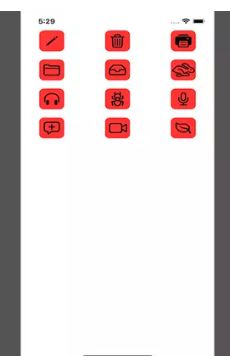
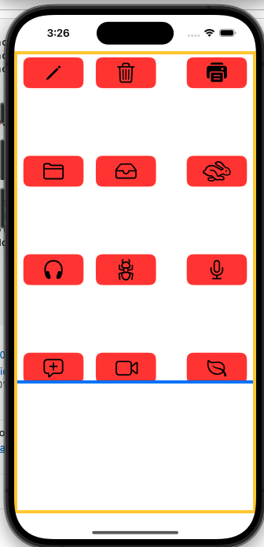

# Learning-UI

# I. LazyGrid

## 1.1 LazyvGrid

```swift
private var gridItems = [GridItem(.flexible()), GridItem(.flexible()), GridItem(.flexible())]

var body: some View {
    // 1
    ScrollView {
        // 2
        LazyVGrid(columns: gridItems, spacing: 20) {
            // 3
            ForEach(icons, id: \.self) {
                // 4
                Image(systemName: $0)
                    .font(.system(size: 30))
                    .frame(width: 50, height: 50)
                    .background(Color.red)
                    .cornerRadius(10)
            }
        }
    }
}
```

Output:



- Ta cần nhúng `Grid` trong `ScrollView`.` bản thân Grid không tự scroll, để có thể cuộn Grid chúng ta cần để nó trong ScrollView`.

### 1.1.1 Layout Grid

Như đã nói bên trên, `layout` của Grid được xác định bằng mảng gridItems. Bên trên chúng ta tạo gridItems gồm 3 phần tử, nên Grid hiển thị ra 3 cột.

- `VD1`: Giờ ta muốn 1 hàng gồm 3 items, mỗi item cách nhau 20, width self-sizing theo màn hình:


```swift
    var body: some View {
        // 1
        ScrollView {
            // 2
            LazyVGrid(columns: gridItems, spacing: 110) {
                // 3
                ForEach(icons, id: \.self) {
                    // 4
                    Image(systemName: $0)
                        .font(.system(size: 30))
//                        .frame(width: 50, height: 50)
                        .frame(minWidth: 0, maxWidth: .infinity)
                        .frame(height: 50)
                        .background(Color.red)
                        .cornerRadius(10)
                }
                
            }
            .padding(.leading, 15)
            .padding(.trailing, 15)
            .padding(.top, 10)
            .border(.blue, width: 5)
        }
        .border(.yellow, width: 5)
        
        Spacer()
    }
```

Output:



- Ở đây ta thấy spacing của `LazyVGrid` là 110, nghĩa là spacing giữa các hàng là 110

## 1.2 LazyHrid

# V. Reference

1. [SwiftUI: Tạo Collection View với LazyVGrid và LazyHGrid trên iOS 14](https://viblo.asia/p/swiftui-tao-collection-view-voi-lazyvgrid-va-lazyhgrid-tren-ios-14-gGJ59MYD5X2)


